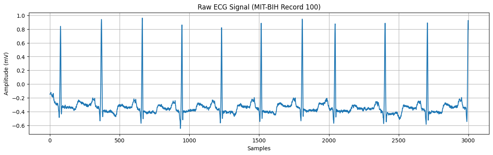
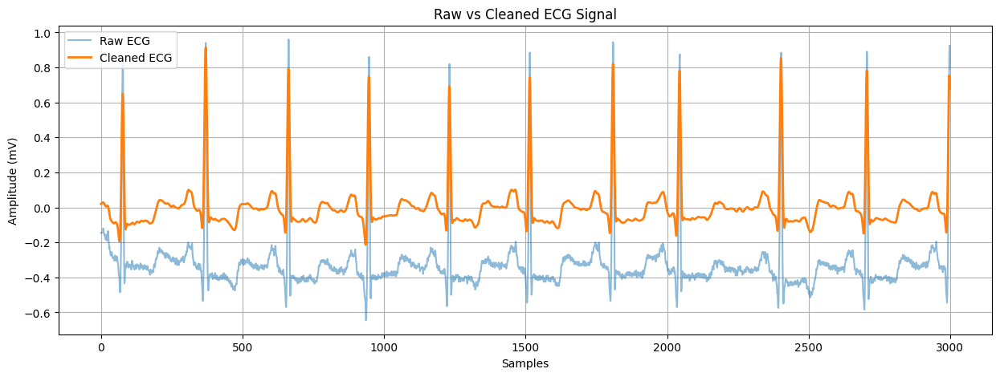
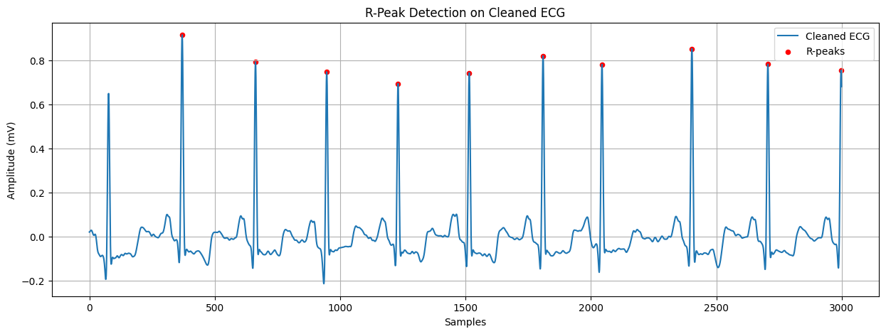
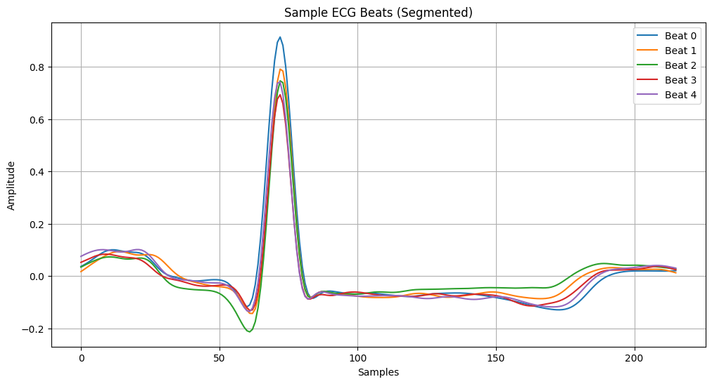
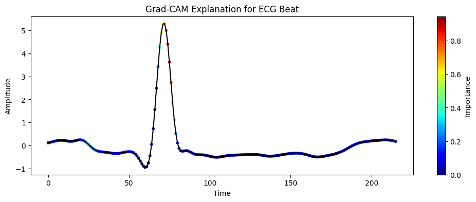
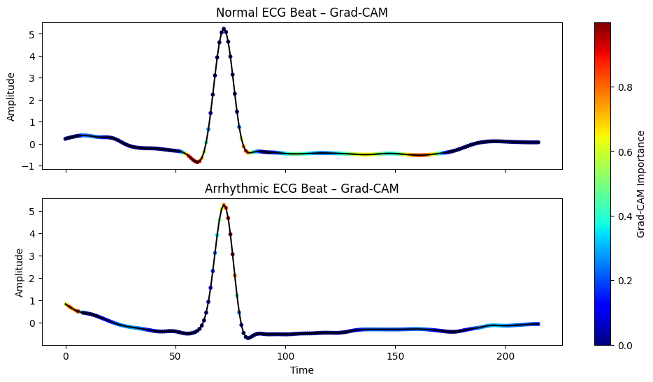

 # ECG Arrhythmia Detection 

 Deep Learning–based ECG Arrhythmia Detection using the MIT-BIH Arrhythmia Dataset. 

 ##  Overview 
 This project implements an end-to-end deep learning pipeline for automatic detection of cardiac arrhythmias from ECG signals. 
 The notebook covers signal preprocessing, heartbeat segmentation, deep learning–based classification, and model interpretation. 
 All results and visualizations shown below are directly generated from the provided code. 

 ##  Dataset 
 - MIT-BIH Arrhythmia Database 
 - Sampling rate: 360 Hz 
 - Source: PhysioNet 

 ##  Signal Processing Pipeline 
 1. ECG signal loading using WFDB 
 2. Signal preprocessing and noise removal 
 3. Heartbeat segmentation 
 4. Deep learning–based classification 
 5. Model interpretation using Grad-CAM 

 ##  Results and Analysis 

 ### Raw ECG Signal 
 

 ### Cleaned ECG Signal 
 

 ### Multiple Heartbeat Segments 
 

 ### Single Heartbeat Segment 
 

 ### ECG Beat with Grad-CAM 
  

 ### Grad-CAM – Normal Beat – Arrhythmic Beat 
 

 ##  Model Interpretation 
 The Grad-CAM visualizations demonstrate that the model bases its decisions on meaningful ECG regions rather than noise. 
 This improves trustworthiness and provides insight into the learned representations of the deep learning model. 

## Run Online (Colab)
You can run the full pipeline and experiments in Google Colab:

